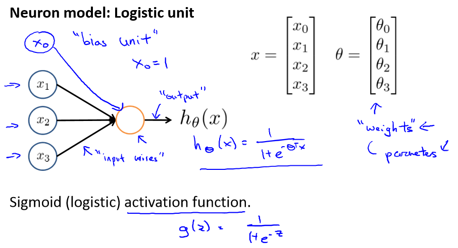

# machine learning
## cock party problem algorithm
```octave
[W, s, v] = svd((remat(sum(x.*x, 1), size(x, 1), 1).*x)*x');
```
### *linear* *cost* *function*

$$
J(\theta_0,\theta_1) = \frac{1}{2m}\sum_{i=1}^m(h_{\theta}(x^{i})-y^{i})^2
$$


$$
\theta_j := \theta_j -\alpha\frac{\partial}{\partial\theta_j}J(\theta_0,\theta_1)    
\quad \quad (for \quad j = 0\quad and \quad j = 1)
$$
*Correct*: *Simultaneous* *update*（**代码实现时需要注意，同时更新参数**）
$$
\begin{align}
temp0 &:= \theta_0-\alpha\frac{\partial}{\partial\theta_0}J(\theta_0,\theta_1)\\
temp1 &:= \theta_1 - \alpha \frac{\partial}{\partial \theta_1}J(\theta_0,\theta_1)\\
\theta_0 &:= temp0\\
\theta_1 &:= temp1
\end{align}
$$

then
$$
\theta_0 := \theta_0 - \alpha\ \frac{1}{m}\sum_{i=1}^m(h_\theta(x^{(i)})-y^{(i)})\\
\theta_1 := \theta_1 - \alpha\ \frac{1}{m}\sum_{i=1}^m(h_\theta(x^{(i)})-y^{(i)})*x^{(i)}
$$

### *Linear* *regression* *with* ***multiple* *variables***

*Hypothesis*:
$$
h_\theta(x) = \theta^Tx = \theta_0x_0+\theta_1x_1+\theta_2x_2 +...+\theta_nx_n
$$
*New* *gradient* *descent*:
$$
\begin{align}
\theta_j &:= \theta_j-\alpha\frac{1}{m}\sum_{i=1}^m(h_\theta(x^{(i)})-y^{(i)})x_0^{(i)}\\
\theta_j &:= \theta_j-\alpha\frac{\partial}{\partial\theta_j}J(\theta)
\end{align}
$$
***Feature*** ***Scaling***(***特征值缩放***):

确保收敛的速度能够尽可能大

***Mean*** ***normalization***(***均值归一化***)：
$$
x^{(i)} = \frac{x^{(i)}-x_{mean}}{range}
$$


***Choose* *lr***(***确定学习率***):

吴恩达老师在课上可能是因为喜欢3这个数字所以并不是通过乘10或者除以10来确定，而是用三

0.001  0.003  0.009（近似于0.01）以此类推

***Features*** ***and*** ***polynomial*** ***regression****(**线性多项式回归***) :
$$
\begin{align}
h_\theta &= \theta_0+\theta_1x_1 +\theta_x2+\theta_3x_3\\ &=\theta_0+\theta_1(size)+\theta_2(size)^2+\theta_3(size)^3
\end{align}
$$

***Normal*** ***equation*** ***and*** ***non***-***invetibility***

*Normal* *equation*
$$
\theta = (X^{T}X)^{-1}X^Ty
$$

```octave
pinv(x'*x)*x'*y
```

注意pinv求得是伪逆就算是不可逆的矩阵都能够算出其广义逆矩阵

*What* *if* $X^{T}X$ *is* *non*-*invertible*

+ Reduandant features(样本所选取的特征量重复有些呈现线性相关)
+ Too many features(样本的数量太多，计算机算力跟不上)

**So there are two ways by which we can find suitable $\theta$ .However, we should prefer the former because the dificulty of computing is increasing with growing parameters**

## *Logistic Regression*

***Classificion***

*注意*，*该算法属于分类问题而并不属于回归问题*

***Logistic*** ***Regression*** ***Model***

we want $0\leq h_{\theta}(x)\leq1$

so
$$
h_{\theta}(x) = g(\theta^{T}x)\\
g(z) = \frac{1}{1+e^{-z}}
$$

***SIgmoid function*** $\Leftrightarrow$ ***Logistic function***

***Decision boundary***(决策界限)

for example
$$
h_{\theta}(x) =g(\theta_0+\theta_1x_1+\theta_2x_2)
$$
predict "y = 1" if
$$
-3+x_{1}+x_{2}\geq0​
$$


then
$$
x_1+x_2\geq3
$$
which is *decision* *boundary*

***cost function***

*comparision*

*linear regression*
$$
J(\theta) = \frac{1}{m}cost(h_{\theta}(x^i),\quad y)\\
cost(h_{\theta}(x),\quad y)=\frac{1}{2}(h_{\theta}(x)-y)^2
$$
*logistic regression*
$$
cost(h_{\theta}(x),\quad y)=
\begin{cases}
-log(h_{\theta}(x)) &if \:\:y= 1 \\
-log(1-h_{\theta}(x))&if \:\:y = 0
\end{cases}
$$
*Then finally*
$$
\begin{align}
J(\theta)=&\frac{1}{m}\sum_{i=1}^mCost(h_{\theta}(x^{(i)}),\,y^{(i)})\\
=&-\frac{1}{m}[\sum_{i=1}^{m}y^{(i)}log\,h_{\theta}(x^{(i)})+(1-y^{(i)})log(1-h_{\theta}(x^{(i)}))]
\end{align}
$$
***Gradient Descent***
$$
\begin{align}
&Reapeat \{\\
&\theta_j :=\theta_j - \alpha\frac{\partial}{\partial\theta_j}J(\theta)\\
\}\quad&(simultaneously \:update\: all\: \theta_j)
\end{align}
$$
*surprisingly*, *after* *simplifiy* *the* *equation* ,*we find that logistic is same as linear in form*
$$
\theta_j := \theta_j-\alpha\frac{1}{m}\sum_{i=1}^m(h_\theta(x^{(i)})-y^{(i)})x_0^{(i)}
$$
*but* ==$h_\theta$== *is* *different*

***Advanced optimization***

*Optimization algorithms*:(*梯度下降算法与后三个算法相比就是个弟弟*)

- Gradient descent
- Conjugate gradient
- BFGS
- L-BFGS

*Example*
$$
\theta=\left[\begin{matrix}
&\theta_1&\\
&\theta_2&
\end{matrix}\right]\\
J(\theta) = (\theta_1-5)^2+(\theta_2-5)^2\\
\frac{\partial}{\partial\theta_1}J(\theta)=2(\theta_1-5)\\
\frac{\partial}{\partial\theta_2}J(\theta)=2(\theta_2-5)
$$


*code*（优化算法代码）

```octave
function [jVal, gradient]= costFunction(theta)
	jVal = (theta(1) - 5)^2 + (theta(2) - 5)^2;
	gradient = zeros(2, 1)
	gradient(1) = 2 * (theta(1) - 5);
	gradient(2) = 2 * (theta(2) - 5);
	
options = optimset('Gradobj', 'on', 'MaxIter', '100');
initialTheta = zeros(2, 1)
[optTheta, functionVal, exitFlag] = fminunc(@costFunction, initialTheta, options);
```

***Multiclass classfication***

*one vs all*

可以理解为

one vs reset

Train a logistic regression classifier $h_{\theta}^{(i)}(x)$ for each class i to predict the probability that y=i

on a new input x,to make a prediction, pick the class i that maximizes

## Regularization(正则化)

***The problem of overfitting*****（过拟合问题）**

*If we have too many features, the learned hypothesis may fit the training set very well , but fail to generalize to new examples (predict prices on new examples).*

***Adress overfitting***

1. *Reduce number of features*
2. ==*Regulariztion*==

***Regularization***
$$
J(\theta)=\frac{1}{2m}[\sum^m_{i=1}(h_{\theta}(x^{(i)})-y^{(i)})^2 + \lambda\sum_{j=1}^n\theta^2_j]
$$
*What if $\lambda$ is set to an extremely large value (perhaps for too large for our problem, say $\lambda = 10^{10}$)?*
*-Algorithm works fine; setting $\lambda$ to be very large can’t hurt it* 

*-Algortihmfails to eliminate overfitting.* 

*-Algorithm results in underfitting. (Fails to fit even training data well).* 

*-Gradient descent will fail to converge*

正则化通过给各参数前设置一个很大的参数，来迫使参数$\theta$能够足够的小，以此来大大减弱高阶项的影响，以此来消除过拟合的影响，但是参数的值也不能设置的太大；否则，就失去作用。

***linear*** ***regression***

*Gradient descent*
$$
\begin{align}
\theta_0 &:= \theta_0 - \alpha[\frac{1}{m}\sum_{i=1}^m(h_\theta(x^{(i)})-y^{(i)})]\\
\theta_1 &:= \theta_1 - \alpha[\frac{1}{m}\sum_{i=1}^m(h_\theta(x^{(i)})-y^{(i)})*x^{(i)}_1-\frac{\lambda}{m}\theta_1]\\
\theta_2 &:= \theta_2- \alpha[\frac{1}{m}\sum_{i=1}^m(h_\theta(x^{(i)})-y^{(i)})*x^{(i)}_2-\frac{\lambda}{m}\theta_2]\\
\end{align}
$$
==***Then***==
$$
\theta_j:=\theta_j(1-\alpha\frac{\lambda}{m})-\alpha\frac{1}{m}\sum_{i=1}^m(h_{\theta}(x^{(i)})-y^{(i)})x_j^{(i)}
$$
*Noraml equation*
$$
\theta = (X^TX\,+\,\lambda B)^{-1}X^Ty\\
B =\left[\matrix{0\quad0...0\\
0\quad1...0\\
\vdots\quad\vdots\ddots\vdots\\
0\quad0\cdots1}\right] 
$$
***Logistic regression***
$$
J(\theta)=-[\frac{1}{m}\sum^m_{i=1}y^{(i)}logh_{\theta}(x^{(i)})+(1-y^{(i)})log(1-h_{\theta}(x^{(i)}))]+\frac{\lambda}{2m}\sum_{j=1}^n\theta^2_j
$$
*gradient descent*
$$
\theta_j:=\theta_j-\alpha[\frac{1}{m}\sum_{i=1}^m(h_{\theta}(x^{(i)})-y^{(i)})x_j^{(i)}-\frac{\lambda}{m}\theta_j]\quad(j=1,2,3...)
$$
*Advanced optimization*

```octave
function [jVal, gradient] = codtFunction(theta)
	jVal = [code to compute J(theta);]
	gradinet(1) = [code to compute \frac{\partial}{\partial\theta_0}J(\theta)]
	...
	gradinet(n+1) = [code to compute \frac{\partial}{\partial\theta_n}J(\theta)]
```

## Neural Networks(神经网络)

***Neuron model: Logistic unit***



***Cost Function(classification)***