# machine learning

# supervised learning

## cock party problem algorithm
```octave
[W, s, v] = svd((remat(sum(x.*x, 1), size(x, 1), 1).*x)*x');
```
### *linear* *cost* *function*

$$
J(\theta_0,\theta_1) = \frac{1}{2m}\sum_{i=1}^m(h_{\theta}(x^{i})-y^{i})^2
$$


$$
\theta_j := \theta_j -\alpha\frac{\partial}{\partial\theta_j}J(\theta_0,\theta_1)    
\quad \quad (for \quad j = 0\quad and \quad j = 1)
$$
*Correct*: *Simultaneous* *update*（**代码实现时需要注意，同时更新参数**）
$$
\begin{align}
temp0 &:= \theta_0-\alpha\frac{\partial}{\partial\theta_0}J(\theta_0,\theta_1)\\
temp1 &:= \theta_1 - \alpha \frac{\partial}{\partial \theta_1}J(\theta_0,\theta_1)\\
\theta_0 &:= temp0\\
\theta_1 &:= temp1
\end{align}
$$

then
$$
\theta_0 := \theta_0 - \alpha\ \frac{1}{m}\sum_{i=1}^m(h_\theta(x^{(i)})-y^{(i)})\\
\theta_1 := \theta_1 - \alpha\ \frac{1}{m}\sum_{i=1}^m(h_\theta(x^{(i)})-y^{(i)})*x^{(i)}
$$

### *Linear* *regression* *with* ***multiple* *variables***

*Hypothesis*:
$$
h_\theta(x) = \theta^Tx = \theta_0x_0+\theta_1x_1+\theta_2x_2 +...+\theta_nx_n
$$
*New* *gradient* *descent*:
$$
\begin{align}
\theta_j &:= \theta_j-\alpha\frac{1}{m}\sum_{i=1}^m(h_\theta(x^{(i)})-y^{(i)})x_j^{(i)}\\
\theta_j &:= \theta_j-\alpha\frac{\partial}{\partial\theta_j}J(\theta)
\end{align}
$$
***Feature*** ***Scaling***(***特征值缩放***):

确保收敛的速度能够尽可能大

***Mean*** ***normalization***(***均值归一化***)：
$$
x^{(i)} = \frac{x^{(i)}-x_{mean}}{range}
$$


***Choose* *lr***(***确定学习率***):

吴恩达老师在课上可能是因为喜欢3这个数字所以并不是通过乘10或者除以10来确定，而是用三

0.001  0.003  0.009（近似于0.01）以此类推

***Features*** ***and*** ***polynomial*** ***regression****(**线性多项式回归***) :
$$
\begin{align}
h_\theta &= \theta_0+\theta_1x_1 +\theta_x2+\theta_3x_3\\ &=\theta_0+\theta_1(size)+\theta_2(size)^2+\theta_3(size)^3
\end{align}
$$

***Normal*** ***equation*** ***and*** ***non***-***invertibility***

*Normal* *equation*
$$
\theta = (X^{T}X)^{-1}X^Ty
$$

```octave
pinv(x'*x)*x'*y
```

注意pinv求得是伪逆就算是不可逆的矩阵都能够算出其广义逆矩阵

*What* *if* $X^{T}X$ *is* *non*-*invertible*

+ Reduandant features(样本所选取的特征量重复有些呈现线性相关)
+ Too many features(样本的数量太多，计算机算力跟不上)

**So there are two ways by which we can find suitable $\theta$ .However, we should prefer the former because the difficulty of computing is increasing with growing parameters**

## Logistic Regression

***Classification***

*注意*，*该算法属于分类问题而并不属于回归问题*

***Logistic*** ***Regression*** ***Model***

we want $0\leq h_{\theta}(x)\leq1$

so
$$
h_{\theta}(x) = g(\theta^{T}x)\\
g(z) = \frac{1}{1+e^{-z}}
$$

***Sigmoid function*** $\Leftrightarrow$ ***Logistic function***

***Decision boundary***(决策界限)

for example
$$
h_{\theta}(x) =g(\theta_0+\theta_1x_1+\theta_2x_2)
$$
predict "y = 1" if
$$
-3+x_{1}+x_{2}\geq0​
$$


then
$$
x_1+x_2\geq3
$$
which is *decision* *boundary*

***cost function***

*comparision*

*linear regression*
$$
J(\theta) = \frac{1}{m}cost(h_{\theta}(x^i),\quad y)\\
cost(h_{\theta}(x),\quad y)=\frac{1}{2}(h_{\theta}(x)-y)^2
$$
*logistic regression*
$$
cost(h_{\theta}(x),\quad y)=
\begin{cases}
-log(h_{\theta}(x)) &if \:\:y= 1 \\
-log(1-h_{\theta}(x))&if \:\:y = 0
\end{cases}
$$
*Then finally*
$$
\begin{align}
J(\theta)=&\frac{1}{m}\sum_{i=1}^mCost(h_{\theta}(x^{(i)}),\,y^{(i)})\\
=&-\frac{1}{m}[\sum_{i=1}^{m}y^{(i)}log\,h_{\theta}(x^{(i)})+(1-y^{(i)})log(1-h_{\theta}(x^{(i)}))]
\end{align}
$$
***Gradient Descent***
$$
\begin{align}
&Reapeat \{\\
&\theta_j :=\theta_j - \alpha\frac{\partial}{\partial\theta_j}J(\theta)\\
\}\quad&(simultaneously \:update\: all\: \theta_j)
\end{align}
$$
*surprisingly*, *after* *simplifiy* *the* *equation* ,*we find that logistic is same as linear in form*
$$
\theta_j := \theta_j-\alpha\frac{1}{m}\sum_{i=1}^m(h_\theta(x^{(i)})-y^{(i)})x_0^{(i)}
$$
*but* ==$h_\theta$== *is* *different*

***Advanced optimization***

*Optimization algorithms*:(*梯度下降算法与后三个算法相比就是个弟弟*)

- Gradient descent
- Conjugate gradient
- BFGS
- L-BFGS

*Example*
$$
\theta=\left[\begin{matrix}
&\theta_1&\\
&\theta_2&
\end{matrix}\right]\\
J(\theta) = (\theta_1-5)^2+(\theta_2-5)^2\\
\frac{\partial}{\partial\theta_1}J(\theta)=2(\theta_1-5)\\
\frac{\partial}{\partial\theta_2}J(\theta)=2(\theta_2-5)
$$


*code*（优化算法代码）

```octave
function [jVal, gradient]= costFunction(theta)
	jVal = (theta(1) - 5)^2 + (theta(2) - 5)^2;
	gradient = zeros(2, 1)
	gradient(1) = 2 * (theta(1) - 5);
	gradient(2) = 2 * (theta(2) - 5);
	
options = optimset('Gradobj', 'on', 'MaxIter', '100');
initialTheta = zeros(2, 1)
[optTheta, functionVal, exitFlag] = fminunc(@costFunction, initialTheta, options);
```

***Multiclass classfication***

*one vs all*

可以理解为

one vs reset

Train a logistic regression classifier $h_{\theta}^{(i)}(x)$ for each class i to predict the probability that y=i

on a new input x,to make a prediction, pick the class i that maximizes

## Regularization(正则化)

***The problem of overfitting*****（过拟合问题）**

*If we have too many features, the learned hypothesis may fit the training set very well , but fail to generalize to new examples (predict prices on new examples).*

***Adress overfitting***

1. *Reduce number of features*
2. ==*Regulariztion*==

***Regularization***
$$
J(\theta)=\frac{1}{2m}[\sum^m_{i=1}(h_{\theta}(x^{(i)})-y^{(i)})^2 + \lambda\sum_{j=1}^n\theta^2_j]
$$
*What if $\lambda$ is set to an extremely large value (perhaps for too large for our problem, say $\lambda = 10^{10}$)?*
*-Algorithm works fine; setting $\lambda$ to be very large can’t hurt it* 

*-Algortihmfails to eliminate overfitting.* 

*-Algorithm results in underfitting. (Fails to fit even training data well).* 

*-Gradient descent will fail to converge*

正则化通过给各参数前设置一个很大的参数，来迫使参数$\theta$能够足够的小，以此来大大减弱高阶项的影响，以此来消除过拟合的影响，但是参数的值也不能设置的太大；否则，就失去作用。

***linear*** ***regression***

*Gradient descent*
$$
\begin{align}
\theta_0 &:= \theta_0 - \alpha[\frac{1}{m}\sum_{i=1}^m(h_\theta(x^{(i)})-y^{(i)})]\\
\theta_1 &:= \theta_1 - \alpha[\frac{1}{m}\sum_{i=1}^m(h_\theta(x^{(i)})-y^{(i)})*x^{(i)}_1-\frac{\lambda}{m}\theta_1]\\
\theta_2 &:= \theta_2- \alpha[\frac{1}{m}\sum_{i=1}^m(h_\theta(x^{(i)})-y^{(i)})*x^{(i)}_2-\frac{\lambda}{m}\theta_2]\\
\end{align}
$$
==***Then***==
$$
\theta_j:=\theta_j(1-\alpha\frac{\lambda}{m})-\alpha\frac{1}{m}\sum_{i=1}^m(h_{\theta}(x^{(i)})-y^{(i)})x_j^{(i)}
$$
*Noraml equation*
$$
\theta = (X^TX\,+\,\lambda B)^{-1}X^Ty\\
B =\left[\matrix{0\quad0...0\\
0\quad1...0\\
\vdots\quad\vdots\ddots\vdots\\
0\quad0\cdots1}\right] 
$$
***Logistic regression***
$$
J(\theta)=-[\frac{1}{m}\sum^m_{i=1}y^{(i)}logh_{\theta}(x^{(i)})+(1-y^{(i)})log(1-h_{\theta}(x^{(i)}))]+\frac{\lambda}{2m}\sum_{j=1}^n\theta^2_j
$$
*gradient descent*
$$
\theta_j:=\theta_j-\alpha[\frac{1}{m}\sum_{i=1}^m(h_{\theta}(x^{(i)})-y^{(i)})x_j^{(i)}-\frac{\lambda}{m}\theta_j]\quad(j=1,2,3...)
$$
*Advanced optimization*

```octave
function [jVal, gradient] = codtFunction(theta)
	jVal = [code to compute J(theta);]
	gradinet(1) = [code to compute \frac{\partial}{\partial\theta_0}J(\theta)]
	...
	gradinet(n+1) = [code to compute \frac{\partial}{\partial\theta_n}J(\theta)]
```

## Neural Networks(神经网络)

***Neuron model: Logistic unit***

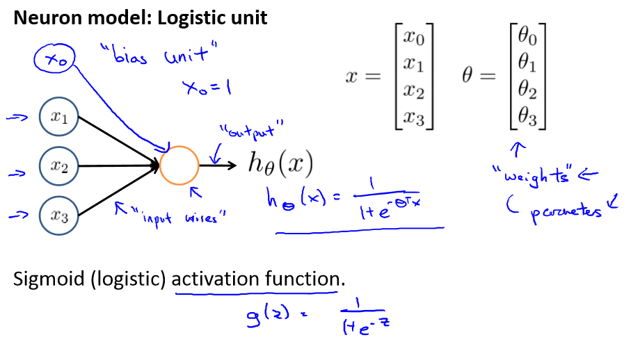

***Cost Function(classification)***
$$
J(\Theta)=-\frac{1}{m}[\sum^m_{i=1}\sum^K_{k=1}y_k^{(i)}log(h_{\Theta}(x^{(i)}))_k+(1-y_k^{(i)})log(1-(h_{\Theta}(x^{(i)}))_k)]+\frac{\lambda}{2m}\sum_{l=1}^{L-1}\sum_{i=1}^{s_l}\sum_{j=1}^{s_{l+1}}(\Theta-{ji}^{(l)})^2
$$
*gradient computation*
$$
\frac{\partial}{\partial \Theta_{ji}^{(l)}}J(\Theta)
$$
*Forward propagation(前向传播算法)*

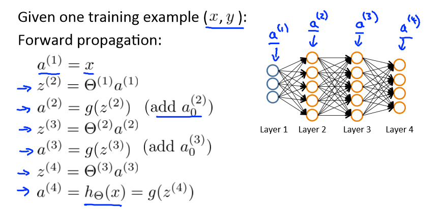

*Backpropagation algorithm*

Intuition:$\delta_j^{(l)}=$"*error*" of node j in layer *l*

*For each out put unit (Layer L=4)*
$$
\delta_j^{(4)}=a_j^{(4)}-y_j\\
\delta^{(3)}=(\Theta^{(3)})^T\delta^{(4)}.*g'(z^{(3)})\\
\delta^{(2)}=(\Theta^{(2)})^T\delta^{(3)}.*g'(z^{(2)})\\
especially(\quad g'(z^{(i)})=a^{(i)}.*(1-a^{(i)})\quad)\\
ignore \quad \lambda;if\;\lambda=0(即没有正则项)
$$

$$
\frac{\partial}{\partial \theta_{ji}^l}J(\Theta)=a_i^{(l)}\delta_j^{(l+1)}
$$


反向传播算法的步骤

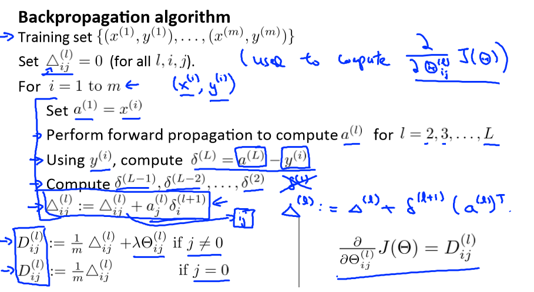

*Forward propagation*

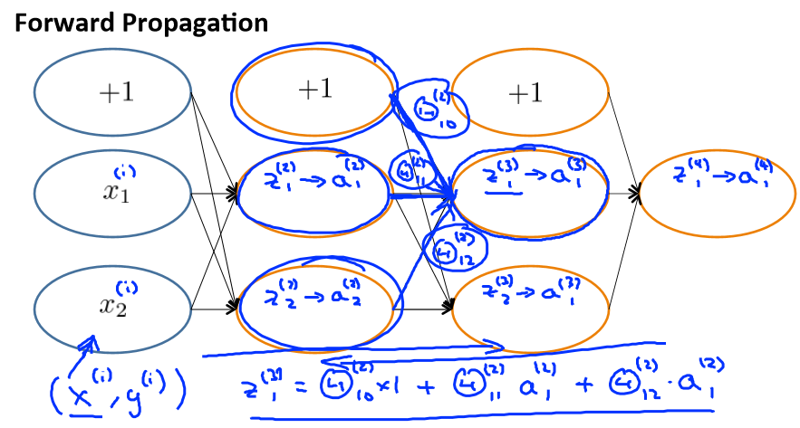

*Gradient checking*(梯度检验)

梯度下降算法本身就会有许多bug，导致最终算出来的结果和实际会有许多的偏差，所以需要提前先进行相关的检验
$$
\frac{\partial}{\partial\theta_i}J(\theta)\approx\frac{J(\theta_1,\theta_2,...,\theta_i+\epsilon)-J(\theta_1,\theta_2,...\theta_i-\epsilon)}{2\epsilon}
$$

```octave
for i = 1:n,
	thetaPlus = theta;
	thetaPlus(i) = thetaPlus(i) + EPSILON;
	thetaMinus = theta;
	thetaMinus(i) = thetaMinus(i) - EPSILON;
	gradApprox(i) = (J(thetaPlus) - J(thetaMinus))/(2*EPSILON);
end;*check that gradApprox $\approx$ DVec*
```

***Implementation Note:***

- Implement backprop to compute DVec(unrooled D^(1), D^(2), D^(3))
- Implement numerical gradient check to compute gradApprox
- Make sure they give similar values
- *==Turn off gradient checking==*. Using backprop code for learning 

***Random initialization***

```octave
optTheta = fminunc(@costFunction, initialTheta, options)
```

***注意！！！！***

不能够将初始化的参数都设置为零，否则会导致每一层的参数权重都是一样的，最后输出的神经元也都一样

Initialize each $\Theta_{ij}^{(l)}$ to a random value in [$-\epsilon, \epsilon$]  $\epsilon \approx 10^{-4}$

*for example* 

```octave
Theta1 = rand(10, 11)*(2*INIT_EPSILON) - INIT_EPSILON;
Theta2 = rand(1, 11)*(2*INIT_EPSILON) - INIT_EPSILON;
```

***putting it together***

*training a neural network*

1. Randomly initialize weights(初始化参数权重)

2. Implement forward propagation to get $h_\Theta(x^{(i)})$ for any $x^{(i)}$(利用前向传播算法，将每一层的结果都算出来)

3. Implement code to compute cost function $J(\Theta)$（编程去实现损失函数）

4. Implement backprop to compute partial derivatives $\frac{\partial}{\partial\Theta_{jk}^{(l)}}J(\Theta)$（再利用反向传播算法去实现每一个权重的求导）

5. Use gradient checking to compare $\frac{\partial}{\partial\Theta_{jk}^{(l)}}J(\Theta)$ computed using backpropagation vs. using numerical estimate of gradient of $J(\Theta)$（将每个逻辑单元的算出来的偏导和自己编程的导数相比较之后检验是都有问题）

   ***Then disable gradient checking code***（第一遍检测完成之后就必须得把它关闭，否则电脑会带不动）

6. Use gradient descent or advanced optimization method with backpropagation to try to minimize $J(\Theta)$ as a function  of parameters $\Theta$（利用梯度下降算法去尽量减小损失函数的值）

## Advice for applying machine learning

***Evaluate a hypothesis***

*divide dataset you collect into three part which contains **training** , **test** , **cross validation***

***procedure***

- Learn parameter $\theta$ from training data

- Compute test set  error:
  $$
  J(\theta)=-[\frac{1}{m_{test}}\sum^m_{i=1}y^{(i)}logh_{\theta}(x^{(i)}_{test})+(1-y^{(i)})log(1-h_{\theta}(x^{(i)}_{test}))]
  $$
  once parameters were fit to some set of data , (training set), the error of parameters as measures on that data is likely to be lower than the actual generalization error(reason: why we need cross validation dataset)

- compute validation error

Training error:
$$
J_{train}(\theta)=\frac{1}{2m}\sum_{i=1}^m(h_{\theta}(x^{(i)})-y^{(i)})^2
$$
Cross validation error:
$$
J_{cv}(\theta)=\frac{1}{2m_{cv}}\sum_{i=1}^{m_{cv}}(h_{\theta}(x^{(i)}_{cv})-y^{(i)}_{cv})^2
$$
Test error:
$$
J_{cv}(\theta)=\frac{1}{2m_{test}}\sum_{i=1}^{m_{test}}(h_{\theta}(x^{(i)}_{test})-y^{(i)}_{test})^2
$$
***Bias / variance***

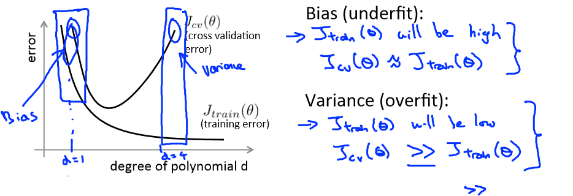

high bias leads to $J_{train}(\theta)$ high and $J_{train}(\theta) = J_{cv}(\theta)$.it is under fit

high variance leads to $J_{train}(\theta)$ will be low but $J_{cv}(\theta) >> J_{train}(\theta)$ it is overfit

from b乎对于高方差的理解，就是预测值的离散程度，而最后模型的误差可以理解为 = 偏差 + 方差

***Regulation and bias / variance***

*Choosing the regulation parameter $\lambda$*

*Linear regression with regularization*
$$
J(\theta) = \frac{1}{2m}\sum_{i=1}^m(h_{\theta}(x^{i})-y^{i})^2 + \frac{\lambda}{2m}\sum_{j=1}^m{\theta}_j^2\\
J_{train}(\theta) = \frac{1}{2m}\sum_{i=1}^m(h_{\theta}(x^{i})-y^{i})^2\\
J_{test}(\theta) = \frac{1}{2m}\sum_{i=1}^m(h_{\theta}(x^{i})-y^{i})^2\\
J_{cv}(\theta) = \frac{1}{2m}\sum_{i=1}^m(h_{\theta}(x^{i})-y^{i})^2
$$
这里涉及到一个细节，就是在进行梯度下降或者是更好的参数算法去优化参数的时候，是需要加上惩罚因子去防止过拟合的现象发生，而当模型参数都已经选定之后再去计算的话，就不需要再加上惩罚项直接计算其误差然后再根据误差去评价

*Bias / variance as a function of the regularization parameter $\lambda$*

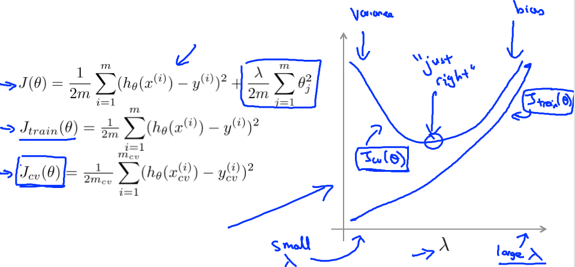

when $\lambda$ is small the model has high variance.Also, when $\lambda$ is too large the model has high bias.

***Learning curves***

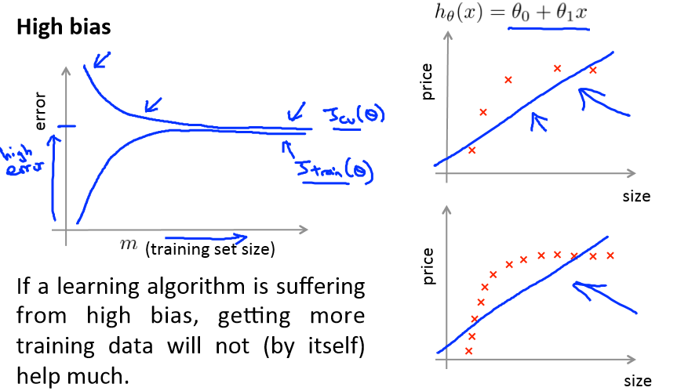

高偏差的学习曲线随着训练的数据集渐渐增大，虽然训练的误差和验证集的误差开始逐渐接近但是最终误差还是很大

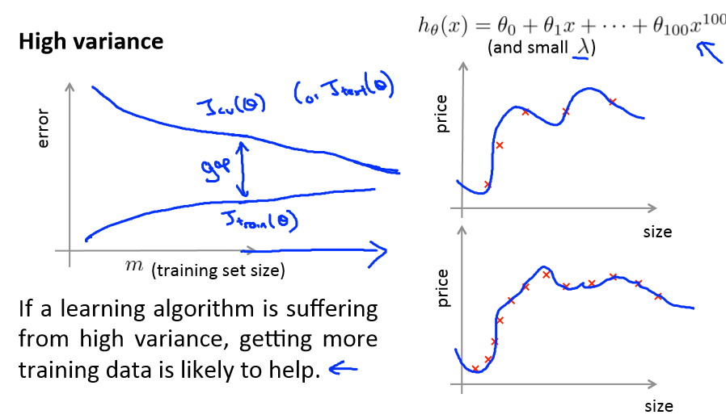

高方差的模型学习曲线就是最终验证集和数据集之间有很大的差异

***==What should you try next?==***

- Get more training examples$\rightarrow$ fixed high variance
- Try smaller sets of features $\rightarrow$fixed high variance
- Try getting additional features $\rightarrow$fixed high bias
- Try adding polynomial features $\rightarrow$fixed high bias
- Try decreasing $\lambda$$\rightarrow$fixed high bias
- Try increasing $\lambda$$\rightarrow$fixed high variance

## Machine learning system design

*recommended approach*

- Start with a simple algorithm that you can implement quickly .Implement it and test it on your cross-validation data
- Plot learning curves to decide if more data, more features,etc. are likely to help.
- Error analysis : Manually examine the examples (in cross validation set) that your algorithm made errors on. See if you spot any systematic trend in what type of examples it is making errors on.

*Error metrics for skewed classes*(偏斜的类，就是两种结果出现的概率差别很大，一个很普遍，一个很少出现)

***Precision/Recall***

|    --     |  --  |     Actual     |     class      |
| :-------: | :--: | :------------: | :------------: |
|    --     |  --  |       1        |       0        |
| Predicted |  1   | True Positive  | False Positive |
|   Class   |  0   | False Negative | True Negative  |

*Precision*
$$
Precision = \frac{True\;positive}{Predicted\;positive} = \frac{True\;positive}{True\;positive+False\;positive}
$$
*Recall*

logistic regression

Suppose we want to predict y=1(cancer) only if very confident

*Higher precision, lower recall* 

Suppose we want to avoid missing too many cases of cancer (avoid false negatives)

*Higher recall, lower precision*（这也太黑心了吧，如果应用在癌症上就是宁可错杀，不肯放过）

*How to compare precision/recall numbers?*

使用调和平均数的方法（也可以理解为电阻并联的方法），将两个指标结合起来考虑
$$
F_1score = 2 * \frac{PR}{P+R}
$$

## Support Vector Machines

***Optimization objective***

*Logistic* *regression*
$$
\min_\theta\frac{1}{m}[\sum_{i=1}^my^{(i)}(-\log h_\theta(x^{(i)}))+(1-y^{(i)})((-\log (1-h_\theta(x^{(i)}))))]+\frac{\lambda}{2m}\sum_{j=1}^n\theta^2_j
$$
*Support vector machine*
$$
\min_\theta C \sum_{i=1}^m[y^{(i)}cost_1(\theta^Tx^{(i)})+(1-y^{(i)})cost_0(\theta^Tx^{(i)})]+\frac{1}{2}\sum_{i=1}^n\theta^2_j
$$
支持向量机的代价函数可以看成是logistic代价函数将$\frac{1}{m}$直接舍去，并且将$\lambda$提出来，C就相当于$\frac{1}{\lambda}$

***Large Margin Intuition***

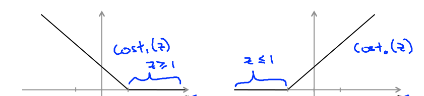

If y = 1,we want $\theta^Tx \geq 1(not just \geq 0)$

If y = 0, we want $\theta^Tx\leq-1(not just <0)$

Linearly separable case

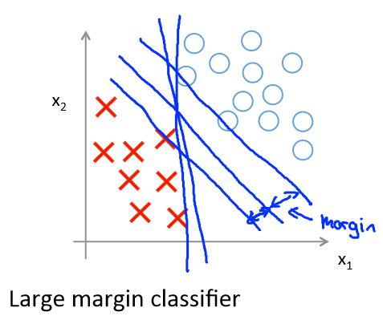

***mathematics***

如果C足够的小，言下之意$\lambda$足够的大

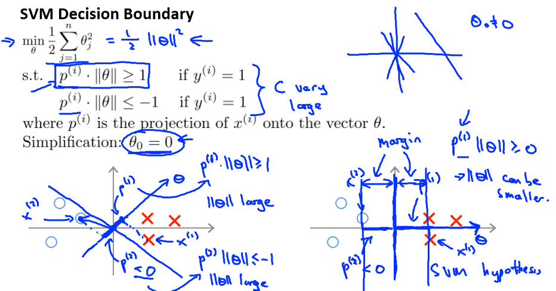

再不妨将偏置设置位0，此时的目标损失函数就等价于各样本在向量$\theta$上的投影的长度和，而边界线也显而易见就是垂直于向量$\theta$的边界

***Kernels***（核函数）

*Non-linear Decision Boundary*（非线性的分界线）

Is there a different / better choice of the features $f$ to replace $x$

Given x, compute new feature depending on proximity to landmarks $l^{(1)},l^{(2)},l^{(3)}$:
$$
f_1 = sililarity(x,l^{(1)}) = exp(-\frac{\|x-l^{(1)}\|^2}{2\sigma^2})\\
f_2 = sililarity(x,l^{(2)}) = exp(-\frac{\|x-l^{(2)}\|^2}{2\sigma^2})\\
f_3 = sililarity(x,l^{(3)}) = exp(-\frac{\|x-l^{(3)}\|^2}{2\sigma^2})
$$
(Gaussian kernels)
$$
\begin{align}
&if \quad x \approx\,l^{(1)}:\\
&f_1 \approx sililarity(x,l^{(1)}) = exp(-\frac{\|x-l^{(1)}\|^2}{2\sigma^2})\approx1\\
&if \quad x \;far\;from\;l^{(1)}:\\
&f_1 \approx sililarity(x,l^{(1)}) = exp(-\frac{\|x-l^{(1)}\|^2}{2\sigma^2})\approx0\\
\end{align}
$$
example:

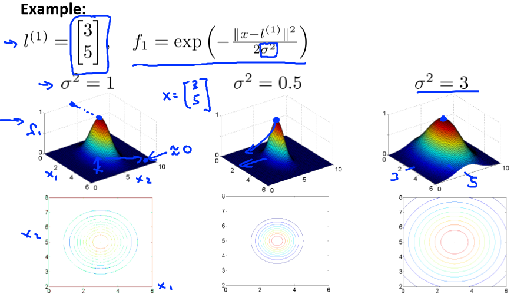

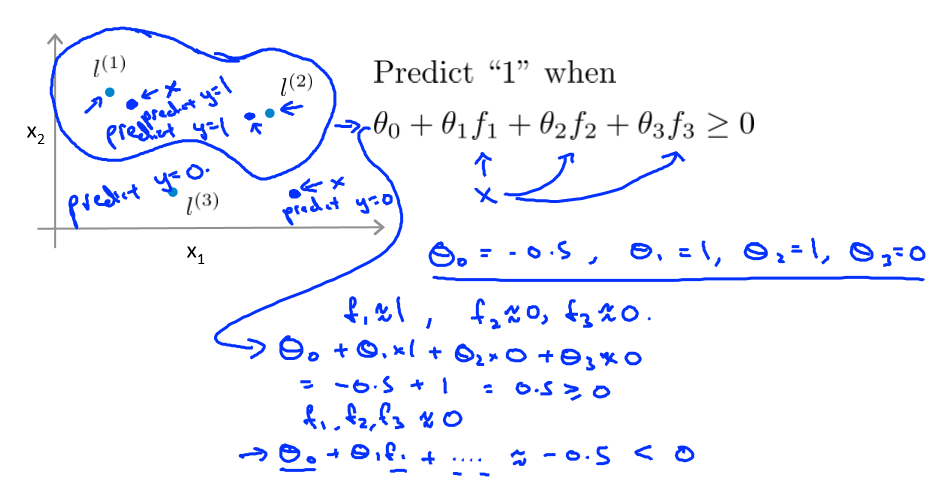

Choosing the landmarks

选择landmark的方法是真的不敢恭维.......由于没有试过所以没法直观的看出这个效果到底是好还是坏

就是将训练集中所有给定的数据的特征作为landmark......
$$
\begin{align}
&f_1=sililarity(x,l^{(1)})\\
&f_2=similarity(x,l^{(2)})\\ 
&...\\
&f_i=similarity(x,l^{(i)})\quad{if\;x\;=x^{(i)}\;then\;f_i=1}
\end{align}
$$
*SVM with Kernels*

Hypothesis :Given x, compute features $f\in\R^{m+1}$.Predict "y = 1" if $\theta^Tf\geq0$

Training:
$$
\min_\theta C\sum^m_{1=1}y^{(i)}cost_1(\theta^Tf^{(i)})+(1-y^{(i)})cost_0*(\theta^Tf^{(i)})+\frac{1}{2}\sum^m_{j=1}\theta^2_j
$$
if m is too large then $\sum_j\theta_j^2=\theta^T\theta$ is replaced by $\theta^TM\theta$（了解即可）

*SVM parameters*

Large C: Lower bias,high variance

Small C: Higher bias,low variance

Large $\sigma^2$: Features $f_i$ vary more smoothly. High bias,lower variance

Small $\sigma^2$: Features $f_i$ vary less smoothly. Lower bias, higher variance

***Using an SVM***

Need to specify:

Choice of parameter C

Choice of kernel(similarity function)  for example : No kernel,Gaussian kernel

~~~octave
function f = kernel(x1, x2)
	f = exp(-(x1 - x2)^2/2*sigma^2)
return
~~~

注意！！！

可以在使用核函数之前进行特征缩放（feature scaling）

核函数的话大部分的情况下，都是使用Gaussian kernel就能够解决问题

Multi-class classification

多目标分类的问题

仍然理解为 one vs all

Logistic regression vs. SVM

n = number of features,m = number of training examples

if n is large:

use logistic regression, or SVM without a kernel("linear kernel")

if n is small, m is intermediate:

Use SVM with Gaussian kernel

if n is small, m is large:

create/add more features, then use logistic regression or SVM without a kernel

Neural network likely to work well for most of these setting, but may be slower to train(神经网络真的适合于各种情况，但是致命的问题就是训练的速度太慢了，而当前人工智能最常用的语言就是python，而python有一个很致命的弱点就是本身的运行效率相较于c++之类的语言就是慢，或许python在将来的某一天会被另外一种语言所替代，这个语言应该和python一样简洁，并且同样有十分强大的线性代数库去支持，与此同时它的运行效率还必须非常的高)

## Unsupervised learning

## clustering(簇) K-means algorithm

***K-means algorithm***

Randomly initialize K cluster centroids
$$
\begin{align}
Reapeat&\{\\
&for\;i =1\;to\;m\\
&\quad c^{(i)} :=index\;(from\;1\;to\;K)\;of\;cluster\;centroid\;closest\;to\;x^{(i)}\\
&for\;k=1\;to\;K\\
&\quad \mu_k:=average\;(mean)\;of\;points\;assigned\;to\;cluster\;k
\\ \}&
\end{align}
$$
上述程序第一个for循环是根据当前的中心点去对样本进行分类

第二个程序的for循环是根据分类完的样本数据集重新确定新的中心点，而中心点的确定方法如下

假设现在属于一个中心点的样本有四个$x^{(1)},x^{(2)},x^{(6)},x{(10)}$

那么新的中心点就是$\mu=\frac{1}{4}[x^{(1)}+x^{(2)}+x^{(6)}+x^{(10)}]\in\R^n$

***Optimization objective***
$$
\begin{align}
&c^{(i)} = index\;of\;cluster\;(1,2,...,K)\;to\;which\;example\;x^{(i)}\;is\;currently\;assigned\\
&\mu_k=cluster\;centroid\;k\;(\mu_k\in\R^n)\\
&\mu_{c^{(i)}}=cluster\;centroid\;of\;cluster\;to\;which\;example\;x^{(i)}\;has\;been\;assigned\\
&Optimization objective:\\
&J(c^{(1)},...,c^{(m)},\mu_1,...,\mu_K)=\frac{1}{m}\sum_{i=1}^{m}\|x^{(i)}-\mu_{c^{(i)}}\|^2\\
&\quad\quad\quad\min_{c^{(1)},...,c^{(m)},\\ \mu_1,...,\mu_K}J(c^{(1)},...,c^{(m)},\mu_1,...,\mu_K)
\end{align}
$$
***Random initialization***

Should have K<m

Randomly pick K training examples

Set $\mu_1,...,\mu_K$ equal to these K examples

随机在样本里去取n个点，作为初始的中心点
$$
\begin{align}
For\;i=1&\;to\;100\{\\
&Randomly\;initialize\;K-means.\\
&Run\;K-means.Get\;c^{(1)},...,c^{(m)},\mu_1,...,\mu_K\\
&Compute\;cost\;function\;(distortion)\\
&J(c^{(1)},...,c^{(m)},\mu_1,...,\mu_K)\\
&\}
\end{align}
$$
***Choosing the number of clusters***(选择有几类)

- *Elbow method*:

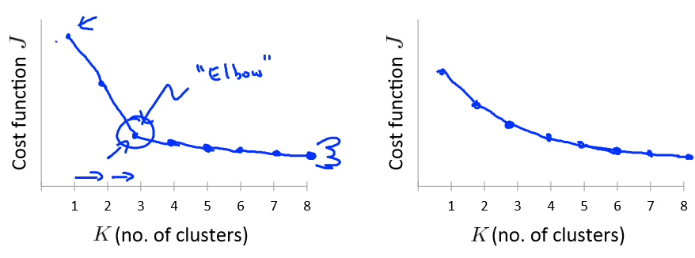

- *For the later purpose*

## Dimensionality Reduction(降维处理)

***Motivation***

- Data compression
- Data Visualization

***principal Component Analysis(PCA) problem formulation***

如果是从二维降到一维，找到一个方向向量，使得样本到这个方向的距离最小

同理是从n维下降到k维，那就找到k个方向向量使得样本到这个k维空间的距离最小

***注意！！！！*** PCA 和线性规划是不一样的

***PCA algorithm***

*Data preprocessing*
$$
\begin{align}
Processing&\;(feature\;scaling/mean\;normalization):\\
&\mu_j=\frac{1}{m}\sum_{i=1}^mx_j^{(i)}\\
&replace\;each\;x_j^{(i)}\;with\;x_j-\mu_j\\
&if\;different\;features\;on\;different\;scales,scales\;features\;to\;have\;comparaable\;range\;of\;values
\end{align}
$$

$$
\begin{align}
Compute\;&"covariance\;matrix":\\
&\sum=\frac{1}{m}\sum_{i=1}^m(x^{(i)})(x^{(i)})^T\\
Compute\;&"eigenvectors"\;of matrix\;\sum:\\
&[U,S,V]\,=\,svd(Sigma)
\end{align}
$$

After mean normalization (ensure every feature has zero mean) and optionally feature scaling:
$$
Sigma = \frac{1}{m}\sum^m_{i=1}(x^{(i)})(x^{(i)})T
$$


```octave
[U, S, V] = svd(Sigma);
Ureduce = U(: ,1:k);
z = Ureduce'*x;
```

*Reconstruction from compressed representation*(对压缩完的数据进行升维)
$$
z = U^T_{reduce}*x\\
x_{approx} = U_{reduce}*z
$$
***Choosing the number of principle components***(选择主成分k的数值)

Choose k to be smallest value so that
$$
\frac{\frac{1}{m}\sum^m_{i=1}\|x^{(i)}-x^{(i)}_{approx}\|^2}{\frac{1}{m}\sum_{i=1}^m\|x^{(i)}\|^2}\leq0.01
$$

```octave
[U, S, V] = svd(Sigma);
```

即
$$
\frac{\sum_{i=1}^kS_{ii}}{\sum_{i=1}^mS_{ii}}\geq0.99
$$
***Advice for applying PCA***

如果使用PCA的话。那么就是将训练的数据集进行降维的到新的数据集的特征；这时需要注意的是利用PCA的算法只能是通过训练集来进行映射，而测试集和交叉验证集的不能再利用PCA的算法，而应当使用训练集生成的降维矩阵U来进行降维

PCA的主要作用其实就是能够让数据可视化，并且能加快计算机运行学习算法的速度

但是！！！不应当将PCA当作防止过拟合的工具，防止过拟合应去增大惩罚项

当你进行一个项目的时候，也不应当直接就去考虑使用PCA算法，应该先去看看直接运行程序会有什么影响

## Anomaly detection(异常检测)

***Gaussian distribution***

*algorithm*
$$
\begin{align}
&1.Choose\;features\;x_i\;that\;you\;think\;ight\;be\;indicative\;of\;anomalous\;examples\\
&2.Fit\;parameters\;\mu_1,...\mu_n,\sigma_1^2,...,\sigma_n^2\\
&\quad\mu_j=\frac{1}{m}\sum_{i=1}^mx_j^{(i)}\\
&\quad\sigma_j^2=\frac{1}{m}\sum_{i=1}^m(x_j^{(i)}-\mu_j)^2(这里在概率论中应是m-1，实际使用时m)\\
&3.Given\;new\;example\;x,compute\;p(x):\\
&\quad p(x)=\prod^n_{j=1}p(x_j;\mu_j,\sigma_j^2)=\prod^n_{j=1}\frac{1}{\sqrt{2\pi}\sigma^2}exp(-\frac{(x_j-\mu_j)^2}{2\sigma_j^2})\\
&\quad Anomaly\;if\;p(x)<\varepsilon
\end{align}
$$
***Developing and evaluating an anomaly detection system***

- Assume we have some labeled data,of anomalous and non-anomalous examples.(y = 0 if normal,y = 1 if anomalous)通常都是倾斜类的情况
- Training set;Cross validation set;Test set

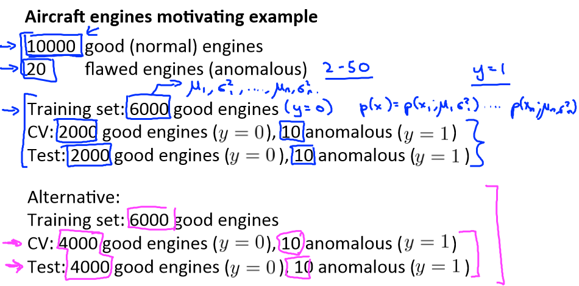

*Algorithm evaluation*
$$
\begin{array}{rcl}
&Fit\;model\;p(x)\;on training\;set\;\{x^{(1)},...,x^{(m)}\}\\
&On\;a\;cross\;validation/test\;example\;x,predict\\
\end{array}
$$

$$
y= \left \{ \begin{array}{rcl}
&1\quad if\;p(x)<\varepsilon\\
&0\quad if\;p(x)>\varepsilon\\
\end{array}
\right.
$$

Possible evaluation metrics:

- True positive,false positive,false negative,true negative
-  Precision/Recall
- F 1_score

***Anomaly detection vs. supervised learning***

Anomaly detection

- very small number of positive examples(y = 1)(0-20 is common)
- Large number of negative (y=0) examples
- Many different types of anomalies. Hard for any algorithm to learn from positive examples what the anomalies look like.

Supervised learning

- Large number of positive and negative examples
- Enough positive examples for algorithm to get a sense of what positive examples are like, future positive examples likely to be similar to ones in training set

***Choosing what features to use***

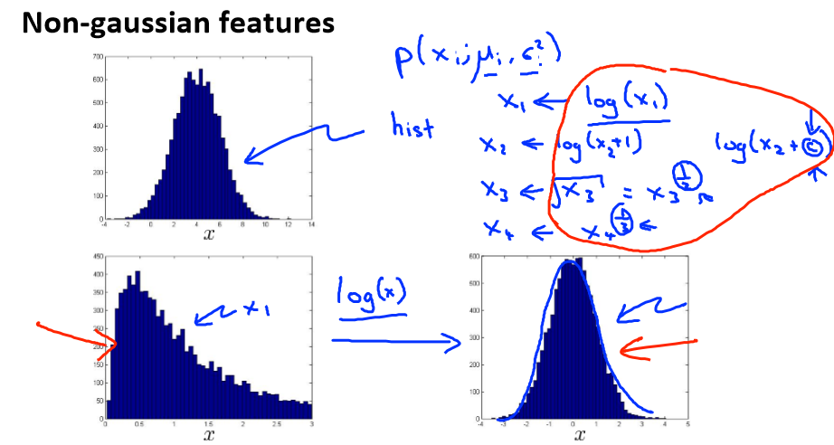

如果训练集原始数据不太符合正态分布的特征，那么就对其进行相关的运算处理，使其呈现出这样的性质。

并且你也可以利用前面的特征，来创造出新的特征量（最好不要是线性的）

***Multivariate Gaussian distribution***

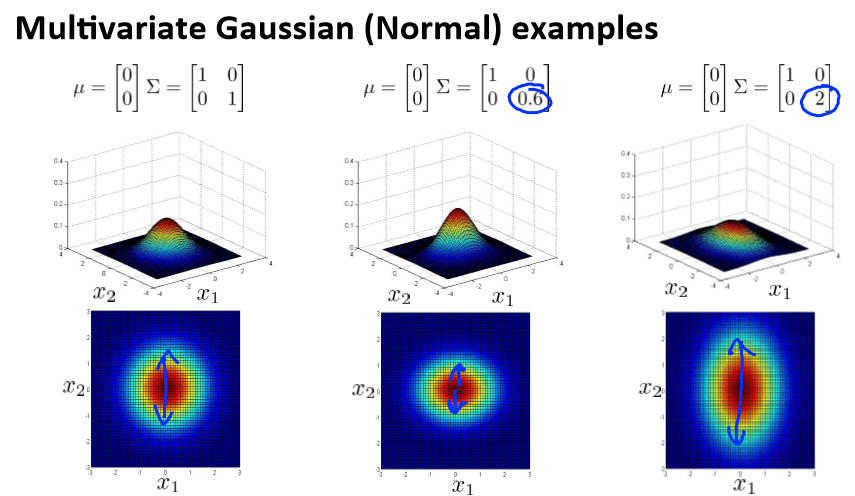

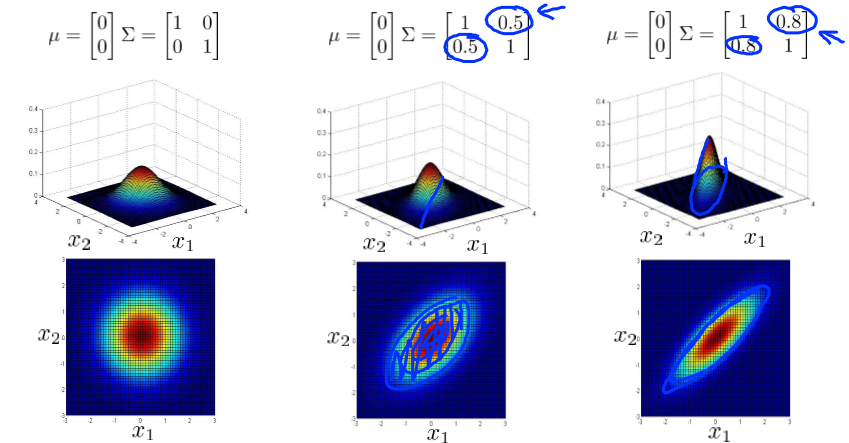

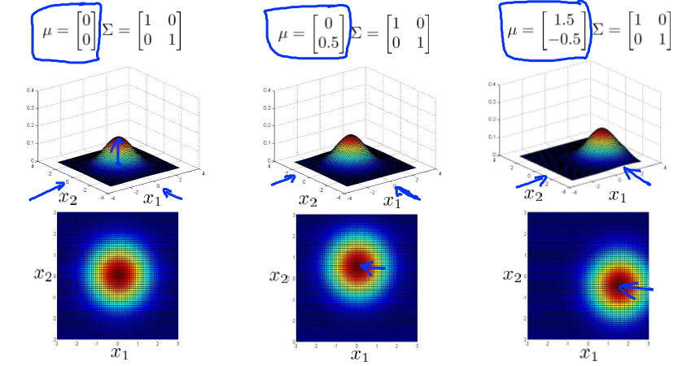
$$
\begin{align}
&p(x;\mu,\Sigma)=\frac{1}{(2\pi)^{\frac{n}{2}}|\Sigma|^{0.5}}exp(-\frac{1}{2}(x-\mu)^T\Sigma^{-1}(x-\mu))\\
&\mu=\frac{1}{m}\sum_{i=1}^mx^{(i)}\quad\quad\Sigma=\frac{1}{m}\sum_{i=1}^m(x^{(i)}-\mu)(x^{(i)}-\mu)^T
\end{align}
$$
前面的原始模型其实就是多元高斯分布的一类特殊情况，只不过协方差矩阵只有主对角线上有值，其它全部为零。

但是原始模型需要的计算量比较小

Original model

- computationally cheaper

Multivariate Gaussian

- computationally more expensive
- Must have m>n or else sigma is non-invertible

## Recommender System

***content-based recommendations***(基于内容的推荐系统)

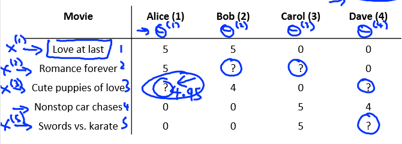

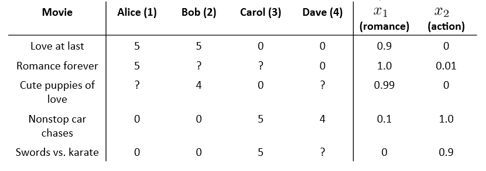

Problem formulation
$$
\begin{align}
&r(i,j)=1\;if\;user\;j\;has\;rated\;movie\;i(0\;otherwise)\\
&y^{(i,j)}=rating\;by\;user\;j\;on\;movie\;i(if\;defined)\\
&\theta^{(j)}=parametr\;vector\;for\;user\;j\\
&x^{(i)}=feature\;vector\;for\;movie\;i\\
&m^{(j)}=no.\;of\;movies\;rated\;by\;user\;j\\
\\
\end{align}
$$
*Optimization objective*
$$
\begin{align}
&To\;learn\;\theta^{(j)}(parameter\;for\;user\;j)\\
&\min_{\theta(j)}\frac{1}{2}\sum_{i:r(i,j)=1}((\theta^{(j)})^Tx^{(i)}-y^{(i,j)})^2+\frac{\lambda}{2}\sum_{k=1}^n(\theta_k^{(j)})^2\\
\\
&To\;learn\;\theta^{(i)},\theta^{(2)},...,\theta^{(n_u)}\\
&\min_{\theta^{(1)},...,\theta^{(n_u)}}\frac{1}{2}\sum_{j=1}^{n_u}\sum_{i:r(i,j)=1}((\theta^{(j)})^Tx^{(i)}-y^{(i,j)})^2+\frac{\lambda}{2}\sum_{j=1}^{n_u}\sum_{k=1}^n(\theta_k^{(j)})^2\\
\end{align}
$$


*Gradient descent*
$$
\begin{align}
&\theta_k^{(j)}:=\theta_k^{(j)}-\alpha\sum_{i:r(i,j)=1}((\theta^{(j)})^Tx^{(i)}-y^{(i,j)})^2x_k^{(i)}\quad for\;k=0\\
&\theta_k^{(j)}:=\theta_k^{(j)}-\alpha(\sum_{i:r(i,j)=1}((\theta^{(j)})^Tx^{(i)}-y^{(i,j)})^2x_k^{(i)}+\lambda\theta_k^{(J)})\quad for\;k\neq0
\end{align}
$$
***Collaborative filtering***（协同过滤）

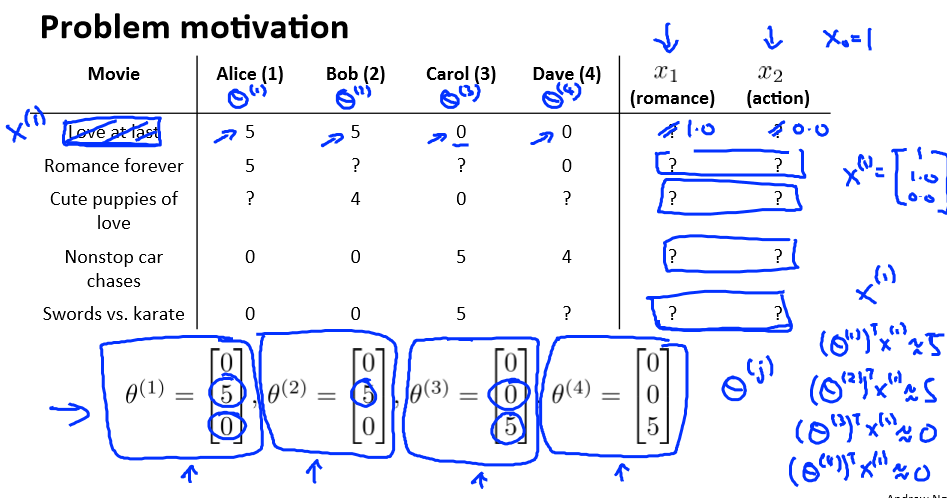
$$
\begin{align}
&Given\;\theta^{(j)},...,\theta^{(n_u)},to\;learn\;x^{(i)}\\
&\min_{\theta(j)}\frac{1}{2}\sum_{j:r(i,j)=1}((\theta^{(j)})^Tx^{(i)}-y^{(i,j)})^2+\frac{\lambda}{2}\sum_{k=1}^n(x_k^{(i)})^2\\
\\
&Given\;\theta^{(j)},...,\theta^{(n_u)},to\;learn\;x^{(i)},...,x^{(n_m)}\\
&\min_{x^{(1)},...,x^{(n_m)}}\frac{1}{2}\sum_{j=1}^{n_u}\sum_{j:r(i,j)=1}((\theta^{(j)})^Tx^{(i)}-y^{(i,j)})^2+\frac{\lambda}{2}\sum_{i=1}^{n_m}\sum_{k=1}^n(x_k^{(i)})^2\\
\end{align}
$$
这个算法的精髓就在于，一旦得到观众对于电影类型的喜爱程度，就可以通过其看的电影推断出这部电影中的各个类型的成分到底有多少，之后再通过其他看这部电影的人推断出这个人到底喜欢看什么类型的电影，以此循环往复。

当上述两个算法整合以后
$$
\min_{x^{(1)},...,x^{(n_m)}\\\theta^{(1)},...,\theta^{(n_u)}}J(x^{(1)},...,x^{(n_m)},\theta^{(1)},...,\theta^{(n_u)})=\frac{1}{2}\sum_{(i,j):r(i,j)=1}((\theta^{(j)})^Tx^{(i)}-y^{(i,j)})^2+\frac{\lambda}{2}\sum_{i=1}^{n_m}\sum_{k=1}^n(x_k^{(i)})^2+\frac{\lambda}{2}\sum_{j=1}^{n_u}\sum_{k=1}(\theta_k^{(j)})^2
$$
Collaborate filtering algorithm
$$
\begin{align}
&1.Initialize\;x^{(1)},...,x^{(n_m)},\theta^{1},...,\theta^{(n_u)}\;to\;small\;random\;values\\
&2.Minimize\;J(x^{(1)},...,x^{(n_m)},\theta^{(1)},...,\theta^{n_u})\;using\;gradient\;descent\;(or\;an\;advanced\;opitimization\;algorithm)\\
&E.G.\;for\;every\;j=1,...,n_u,i=1,...,n_m:\\
&x_k^{(i)}:=x_k^{(i)}-\alpha(\sum_{j:r(i,j)=1}((\theta^{(j)})^Tx^{(i)}-y^{(i,j)})^2\theta_k^{(i)}+\lambda x_k^{(i)})\\
&\theta_k^{(j)}:=\theta_k^{(j)}-\alpha(\sum_{i:r(i,j)=1}((\theta^{(j)})^Tx^{(i)}-y^{(i,j)})^2x_k^{(i)}+\lambda\theta_k^{(j)})\\&在这一算法我们不再纠结于偏置的问题\\
&For\;a\;user\;with\;parameters\;\theta\;and\;a\;movie\;with\;(learned)\;features\;x,predict\;a\;star\;rating\;of\;\theta^Tx
\end{align}
$$
***Vectorization: Low rank matrix factorization***（低秩矩阵的分解）

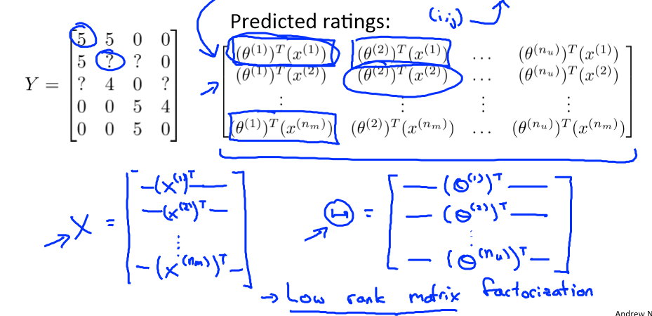

个人认为就是将其中的元素向量化

***Mean normalization***

这一步的意义就是，如果是一个新用户，他的喜好我们不知道所以$\theta$的元素就是零，那么你无法判断出新用户对于每一个电影的喜爱程度，如果都是零的话，系统也无法正常推荐电影，所以在一开始先将每一部电影人们对其的平均分算出来之后再与该电影每个人的打出来的分数相减，使得该电影的评分均值为零。之后预测评分的时候还要再加上均值，这样如果预测是零，但加上均值之后就不会再是零了。

## Large scale machine learning

***Stochastic gradient descent***

Linear regression with gradient descent
$$
\begin{align}
&h_\theta=\sum_{j=0}^n\theta_jx_j\\
&J_{train}(\theta)=\frac{1}{2m}\sum_{i=1}^m(h_\theta(x^{(i)})-y^{(i)})^2\\
&Repeat\{\\
&\quad\theta_j:=\theta_j-\alpha\frac{1}{m}\sum_{i=1}^m(h_\theta(x^{(i)})-y^{(i)})x_j^{(i)}\\
&(for\;every\;j=0,...,n)\\
\}
\end{align}
$$
*Stochastic gradient descent*
$$
\begin{align}
&1.Randomly\;shuffle\;(reorder)\;training\;examples
\\&2.Repeat\{\\
&\quad for\;i:=1,...,m\{
\\&\quad\quad\theta_j:=\theta_j-\alpha(h_\theta(x^{(i)})-y^{(i)})x_j^{(i)}\\
&\quad\quad(for\quad j=0,...,n)\\
&\quad\}\\
&\}
\end{align}
$$
Learning rate $\alpha$ is typically held constant. Can slowly decrease $\alpha$ over time if we want $\alpha$ over time if we want $\theta$ to converge $\alpha=\frac{const1}{iterationNumber+const2}$

***Mini-batch gradient descent***

say b=10,m=1000
$$
\begin{align}
&Repeat\{\\
&\quad for\;i=1,11,21,31,...,991\{\\
&\quad\quad\theta_j:=\theta_j-\alpha\frac{1}{10}\sum_{k=i}^{i+9}(h_\theta(x^{(k)})-y^{(k)})x_j^{(k)}\\&(for\;every\;j=0,...,n)\\
&\quad\}\\
&\}
\end{align}
$$
*Batch gradient descent: Use all m examples in each iteration*

*Stochastic gradient descent: Use 1 example in each iteration*

*Mini-batch gradient descent: Use b examples in each iteration*

有的时候mini-batch的效果可能比随机梯度下降的效果更好

***Stochastic gradient descent convergence***

Stochastic gradient descent:
$$
\begin{align}
&cost(\theta,(x^{(i)},y^{(i)}))=\frac{1}{2}(h_\theta(x^{(i)})-y^{(i)})^2\\
&During\;learning,compute\;cost(\theta,(x^{(i)},y^{(i)}))before\;updatin\;\theta\;using(x^{(i)},y^{(i)})\\
&Every\;1000\;iterations\;(say),plot\;cost(\theta,(x^{(i)}),y^{(i)})\;averaged\\
&\quad over\;the\;last\;1000\;examples\;processed\;by\;algorithm
\end{align}
$$
随机梯度下降有一个问题，就是收敛到最后，它肯定到达不了最优解，而是在其附近徘徊

***Online learning***
$$
\begin{align}
&Repeat\;forever\{\\
&Get\;(x,y)\;corresponding\;to\;user\\
&update\;\theta\;using\;(x,y):\\
&\quad\theta_j:=\theta_j-\alpha(h_\theta(x)-y)x_j

\\\}
\end{align}
$$
这个算法就不存在训练集的概念了，因为是在线学习所以样本都是源源不断的过来，它可以适应用户习惯的改变

***Map-reduce and data parallelism***

思想就是将很庞大的计算量，平均分配给几台机器去运行，之后再汇集到一台机器上进行求和，效率会快很多。

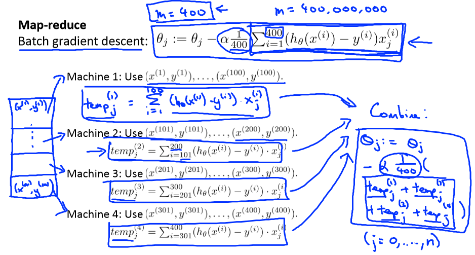

## Application example

***photo OCR***

1. Text detection
2. Character segmentation
3. Character classification

***Sliding windows***(滑动窗口)

监督学习的行人检测

首先将positive examples，negative positive examples 都整合成同样尺寸的图片大小（比如82 x 36）

然后将需要检测的图片利用滑动窗口进行一定步长的滑动检测，如果没有检测到可以将滑动窗口尺寸进行扩大，然后再进行检测

***Artificial data synthesis***（人工合成数据）其实就是数据增强

注意如果给图片中的每一个像素点加上随机的噪声可能效果并不会特别的明显

每次开始进行项目搜集数据的时候，都可以来问一问自己能不能搜集到所要求的数据的十倍的数据。如果可以的话，所需要的时间多不多，最终往往其实花费的时间并不是很多就可以搜集到更多的数据。

***Ceiling analysis***(天花板分析)

就是将你的项目按照流程分成好几个类，然后如果总体的准确率较低的话就手动从开始一个部分一个部分的调整，观察准确率上升的变化，有些环节你会发现就算提高它的精度，对整体的准确度却没有太大的帮助，这样会帮助你尽快确定接下来的重点工作范围。

# *that's all*

